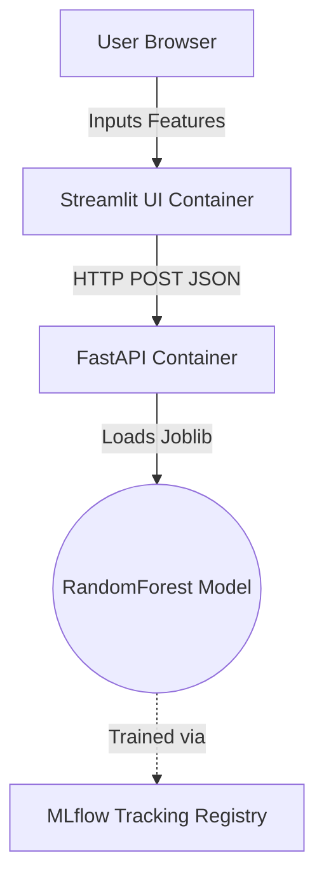

# 🍷 Inliefde Wine Predict System

[](https://fastapi.tiangolo.com/)
[](https://streamlit.io/)
[](https://mlflow.org/)
[](https://www.docker.com/)

A completely self-contained, end-to-end Machine Learning deployment system built for the **SIS-3** assignment. This project classifies Wine cultivars across 13 chemical features utilizing a robust, separation-of-concerns architecture.

## 🏗 System Architecture

The project guarantees production-level standards by strictly separating the UI layer from the Backend model inference layer.



### Key Technical Aspects
* **Strict Type Validation:** All incoming Streamlit requests are validated against a 13-field Pydantic `BaseModel` on the FastAPI backend, guaranteeing no crashes on malformed data.
* **Separation of Concerns:** The model is not accessible directly. It lives exclusively behind the FastAPI gateway.
* **Reproducibility:** The `docker-compose` setup natively orchestrates both services concurrently on separate, exposed ports.

---

## 🚀 Quick Start / Demo

To run the full stack flawlessly, you will deploy the registry first, and then spin up the microservices.

### Phase 1: Train & Register the Model
Before launching the microservices, populate your local `mlruns/` registry and compile the initial `model.joblib`. Ensure you run this from your virtual environment's root:

```bash
pip install -r requirements.txt

python train.py
```

*To verify your metrics and registered models, you can run `mlflow ui` here and check `http://localhost:5000`.*

### Phase 2: Launch the Microservices
With the model trained naturally, it is now baked into the Docker ecosystem. Launch both the frontend and backend microservices concurrently:

```bash
docker-compose up --build -d
```
*(Note for newer Docker systems: you may need to use `docker compose` without the hyphen).*

### Phase 3: Access the System
Once the containers spin up, your endpoints are exclusively mapped as follows:
* 🖥 **Frontend App (Streamlit):** [http://localhost:8501](http://localhost:8501)
* ⚙️ **Backend API (FastAPI):** [http://localhost:8000/](http://localhost:8000/)
* 📚 **API Swagger Docs:** [http://localhost:8000/docs](http://localhost:8000/docs)

---

## 📁 Repository Structure

```text
practice6/
├── app.py                 
├── main.py              
├── train.py               
├── requirements.txt       
├── Dockerfile             
├── streamlit.Dockerfile   
├── docker-compose.yml    
└── README.md             
```
```
*(If you are on newer docker versions without docker-compose, use `docker compose up --build -d`)*

## Step 3: Test the Application

Navigate to your Streamlit frontend inside your browser:
- **UI Website:** [http://localhost:8501](http://localhost:8501)

You can view the raw API directly as well if needed:
- **API Root:** [http://localhost:8000/](http://localhost:8000/)
- **Swagger Docs:** [http://localhost:8000/docs](http://localhost:8000/docs)
